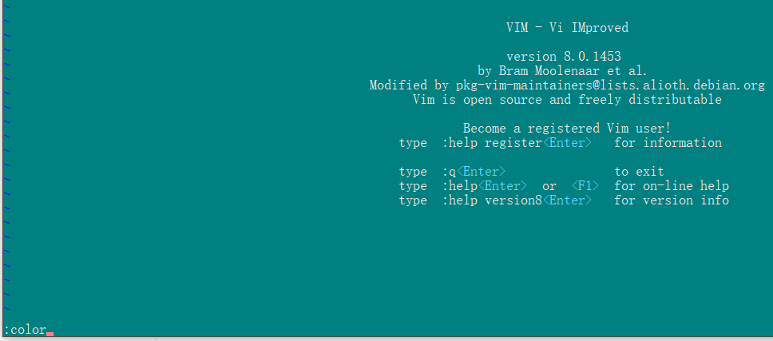
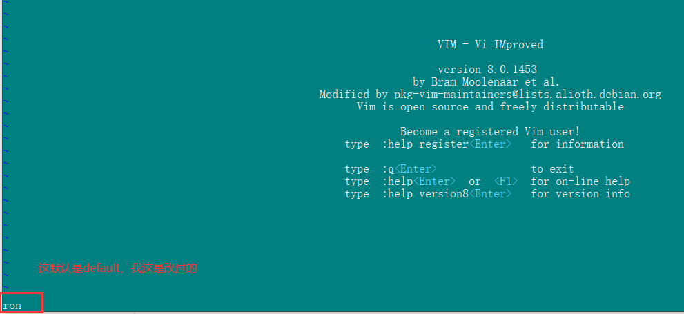
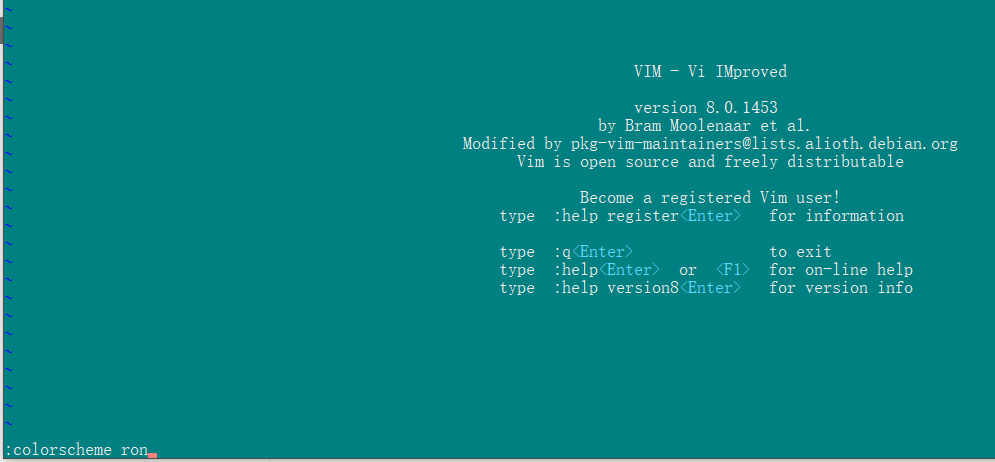
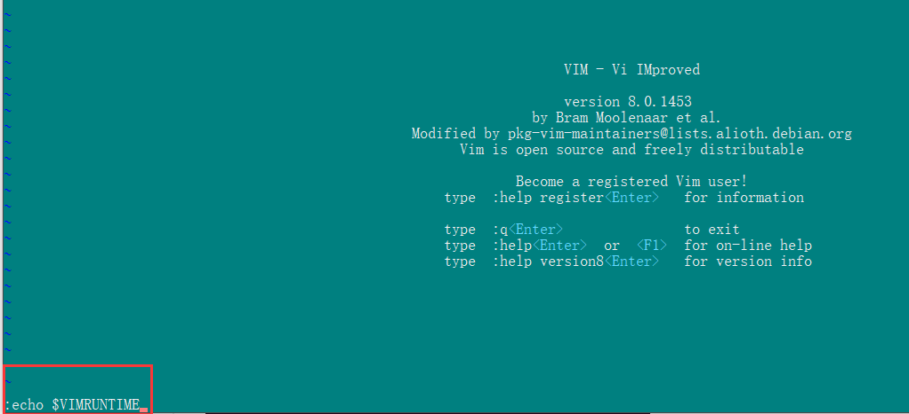
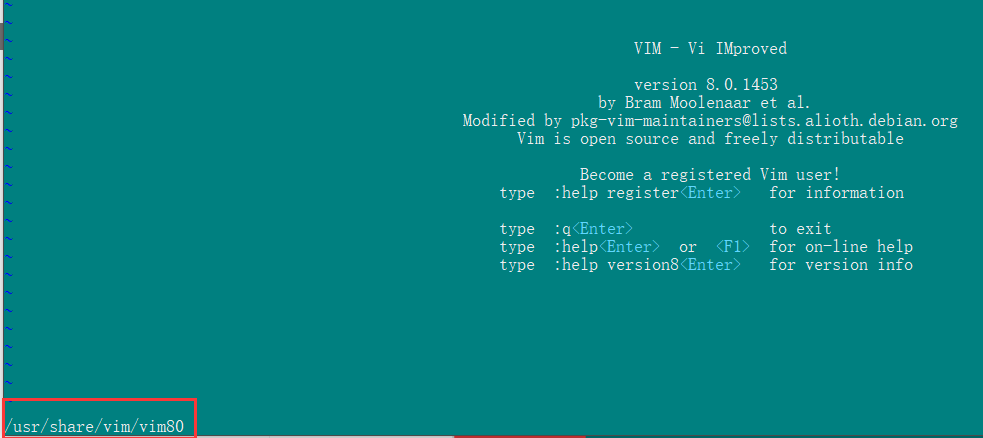
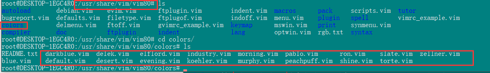

### 1、查看Vim实例中当前的颜色主题

打开一个Vim窗口，输入命令:color或:colorscheme后回车查看当前的颜色主题。

可以看到当前的颜色主题默认为default

### 2、Vim实例中设置颜色主题

输入命令"colorscheme 主题名字"，即可设置当前vim实例的颜色主题

### 3、查看提供的vim颜色主题

vim的颜色主题文件放在Vim运行目录下的color目录下，所以我们首先需要知道vim的运行目录

在vim中输入命令:echo $VIMRUNTIME 来查看Vim的运行目录

得到vim的运行目录,从图中可以看到，vim的运行路径为**/usr/share/vim/vim80 **

进入vim的运行目录，查看colors目录下以“.vim”为结尾的文件,

### 4、修改vim配置文件，更改默认颜色主题

打开/etc/vim/vimrc文件，在其中加入一行"colorscheme 颜色主题名字"，之后保存更改即可

